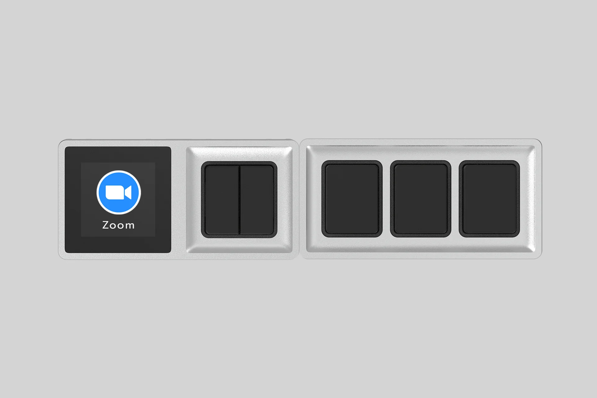

# WEB DESIGN RULES:

1. Every Image should have alt property. Ex:

```
  
```

2. Every tags should have close and ending tags. Ex:

```
    <p>Hello, World</p>

    <!-- If tag with no close tags, their should be a space before the slash -->
    <br />
```

3. Semantic HTML, the HTML format should follow the semantic way of writing html. Ex.

```
    <!-- Header -->
    <header>
        <nav></nav>
    </header>

    <!-- Main Content -->
    <main>
        <section></section>
    </main>

    <!-- Footer -->
    <footer>
    </footer>
    <>
```

# Let's get the fucking championship this year niggers! Goodluck! 🏆🏅
